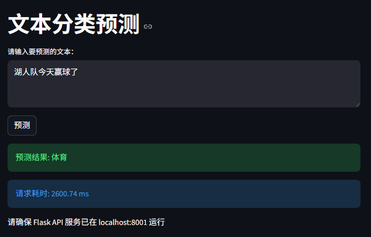

# 💎 News-Prism Classifier | 中文新闻文本分类系统

[](https://www.python.org/)
[](https://flask.palletsprojects.com/)
[](https://scikit-learn.org/)
[](LICENSE)

> **News-Prism** 是一个生产级、全栈式的中文新闻文本分类解决方案。
> 项目实现了从 **数据清洗 (ETL)** -> **特征工程 (TF-IDF)** -> **模型训练** -> **微服务部署 (Flask)** -> **可视化交互 (Streamlit)** 的完整闭环。

---

## 📸 效果演示 (Demo)


*Streamlit 可视化交互界面*

---

## 🚀 快速开始 (Quick Start)

### 1. 环境准备
推荐使用 `Conda` 或 `virtualenv` 创建独立环境。

```bash
# 克隆项目
git clone [https://github.com/your-username/News-Prism-Classifier.git](https://github.com/your-username/News-Prism-Classifier.git)
cd News-Prism-Classifier

# 安装依赖
pip install -r requirements.txt
```

### 2. 数据预处理 (ETL)
**首次运行必须执行！** 将原始语料清洗并分词，生成训练所需的 CSV 文件。

```bash
python data_EDA.py
```

### 3. 模型训练 (Model Training)
读取 CSV 数据，进行 TF-IDF 向量化和随机森林训练。
**注意：** 生成的模型文件 (`.pkl`) 约为 **1.5GB**，训练过程可能需要几分钟。

```bash
python train.py
# Output: save_model/rf_model_1.pkl
```

---

## 💻 启动服务 (Run Application)

本项目采用 **前后端分离** 架构，必须**同时启动**后端 API 和前端界面。

### 第 1 步：启动后端 API (Terminal 1)
打开一个新的终端窗口，运行 Flask 服务。它将监听 `8001` 端口，处理预测请求。

```bash
python api.py
```
> *看到 "Running on [http://0.0.0.0:8001](http://0.0.0.0:8001)" 即代表启动成功。请勿关闭此窗口！*

### 第 2 步：启动前端界面 (Terminal 2)
打开第二个终端窗口，启动 Streamlit 可视化服务。

```bash
streamlit run app.py
```
> *浏览器将自动打开交互页面，即可开始输入文本进行测试。*

---

## 📂 项目目录与文件说明 (Structure & Manifest)

### 1. 目录结构
```text
News-Prism-Classifier/
├── 📄 api.py               # Flask 后端接口
├── 📄 app.py               # Streamlit 前端应用
├── 📄 config.py            # 全局路径配置
├── 📄 data_EDA.py          # ETL 数据清洗脚本
├── 📄 train.py             # 模型训练脚本
├── 📄 predict_fun.py       # 核心推理逻辑封装
├── 📄 requirements.txt     # 项目依赖
├── 📂 data/                # 数据仓库 (原始语料 & 停用词)
├── 📂 save_model/          # [Git忽略] 训练好的模型文件
└── 📂 result/              # [Git忽略] 预测结果
```

### 2. 文件功能详细说明 (File Manifest)

| 文件名 (File) | 类型 | 核心功能说明 (Description) |
| :--- | :--- | :--- |
| **`data_EDA.py`** | 🧹 ETL清洗 | **数据预处理入口**。<br>1. 读取 `data/train.txt` 原始语料。<br>2. 调用 `jieba` 进行中文分词。<br>3. 截取文本前 30 个词（降维处理）。<br>4. 生成 `process_train.csv` 供训练使用。 |
| **`train.py`** | 🧠 训练脚本 | **模型训练主程序**。<br>1. 读取处理后的 CSV 数据。<br>2. 加载停用词表 `stopwords.txt`。<br>3. 执行 TF-IDF 向量化转换。<br>4. 训练随机森林 (RandomForest) 模型。<br>5. 保存模型到 `save_model/` 目录。 |
| **`api.py`** | 🔌 后端服务 | **Flask API 服务端**。<br>启动一个 Web 服务器 (Port 8001)，提供 `POST /predict` 接口。<br>接收 JSON 请求，调用核心逻辑返回分类结果。 |
| **`app.py`** | 🖥️ 前端界面 | **Streamlit 可视化客户端**。<br>提供交互式 Web 页面。<br>用户输入文本 -> 发送 HTTP 请求给后端 -> 展示分类结果。<br>*(依赖 `api.py` 运行)* |
| **`predict_fun.py`** | ⚙️ 核心逻辑 | **推理逻辑封装包**。<br>被 `api.py` 引用。包含 `predict()` 函数，负责：<br>1. 实时加载模型。<br>2. 对单条文本进行分词和向量化。<br>3. 输出预测类别（如：体育、财经）。 |
| **`config.py`** | 🔧 配置文件 | **全局配置中心**。<br>统一管理所有文件的读取路径和保存路径，避免代码中出现硬编码 (Hard Code)。 |
| **`predict.py`** | 🧪 离线验证 | **批量预测脚本**。<br>用于在开发集 (`dev.txt`) 上批量跑分，验证模型效果，结果保存在 `result/` 中。 |
| **`api_test.py`** | 🚦 测试脚本 | **接口连通性测试**。<br>一个简单的 Request 脚本，用于检测 Flask 服务是否启动成功。 |
| **`requirements.txt`**| 📦 依赖清单 | **环境配置文件**。<br>记录项目运行所需的所有 Python 库 (Flask, Streamlit, Sklearn, Jieba 等)。 |

---

## 📡 API 文档 (API Documentation)

你也可以直接通过 HTTP 请求调用分类服务。

**接口地址**: `POST http://127.0.0.1:8001/predict`

**请求示例 (Python):**
```python
import requests

url = '[http://127.0.0.1:8001/predict](http://127.0.0.1:8001/predict)'
data = {'text': "中国男篮在昨晚的比赛中绝杀对手，晋级决赛。"}

res = requests.post(url, json=data)
print(res.json())
```

**响应示例:**
```json
{
    "text": "中国男篮在昨晚的比赛中绝杀对手，晋级决赛。",
    "pred_class": "体育"
}
```

---

## 🤝 贡献 (Contribution)

欢迎提交 Issue 或 Pull Request！

1. Fork 本仓库
2. 新建 Feat_xxx 分支
3. 提交代码
4. 新建 Pull Request

---

## 📄 版权说明 (License)

本项目采用 [MIT License](LICENSE) 开源。
